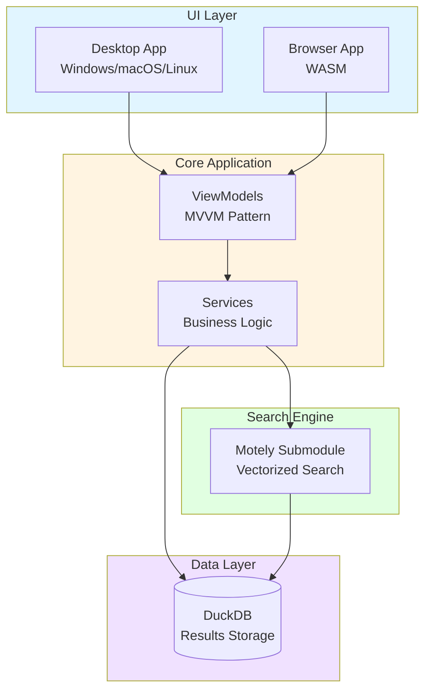

# Balatro Seed Oracle

[](https://github.com/OptimusPi/BalatroSeedOracle/actions/workflows/build-browser.yml)
[](https://www.gnu.org/licenses/gpl-3.0)
[](https://dotnet.microsoft.com/download/dotnet/10.0)

Search millions of Balatro seeds to find the perfect runs for your strategies.

## Project Status

**Active Development** - This project is actively maintained and welcomes contributions.

See [CHANGELOG.md](CHANGELOG.md) for version history and [GitHub Releases](https://github.com/OptimusPi/BalatroSeedOracle/releases) for downloads.

## What is this?

Balatro Seed Oracle helps you find specific Balatro seeds based on detailed criteria:

- **Find exact joker combinations** - Blueprint + Brainstorm in specific antes
- **Locate rare voucher chains** - Telescope → Observatory progressions
- **Hunt for soul jokers** - Negative Perkeo with specific pack requirements
- **Search for perfect setups** - Specific bosses, tags, spectral cards, etc.

Built for the Balatro community to discover optimal seeds for challenge runs, high scores, and specific strategies.

## Architecture



**Key Components:**
- **Avalonia UI**: Cross-platform desktop and browser framework
- **MVVM Pattern**: Clean separation of UI and business logic
- **DuckDB**: Fast analytical database for search results
- **Motely**: High-performance vectorized seed search engine

## Installation

### Requirements

- Windows, Linux, or macOS*
- Intel, AMD, or Apple Silicon CPU**
- [.NET 10 SDK](https://dotnet.microsoft.com/download/dotnet/10.0)
- [git](https://git-scm.com/downloads)]

### NOTE on other compatibilities

- Not sure if other OS will work such as BSD, but it probably will.
- I think this might work on other CPUs like ARM, but I have not tested it.
- I think I might need some changes to Motely's Vector helpers to make it work, but it's possible the fallbacks (if AVX512 and/or AVX2 not supported) tacodiva added already will be compatible.
- Mobile would be really cool in the future.
- Web page version would be really cool in the future.

## Clone this repository (or download zip, or use Github Desktop)

Either click the green button in the upper-right of this page and download in your favorite way...or:

```sh
git clone https://github.com/OptimusPi/BalatroSeedOracle.git
cd BalatroSeedOracle
dotnet run -c Release --project ./src/BalatroSeedOracle/BalatroSeedOracle.csproj
```

## Initialize the git Submodule

This repo uses git submodules to include the Motely search engine.
The git submodule is my fork of tacodiva/Motely that includes the MotelyJson support!
You need to initialize and update the submodule after cloning:

```bash
git submodule update --init --recursive
```

## Run the Balatro Seed Oracle GUI Application

### Using Taskfile (Recommended)

Install [go-task](https://taskfile.dev/):

```sh
# macOS
brew install go-task

# Windows/Linux - see https://taskfile.dev/installation/
```

Common commands:

```sh
# One-time setup (submodules, tools, packages)
task setup

# Run desktop app (Release - fast)
task run:desktop

# Run desktop app (Debug - for debugging)
task run:desktop:debug

# Run browser/WASM app
task run:browser

# Publish browser app
task publish:browser
task publish:browser:threaded

# Format code
task format

# Run tests
task test

# Clean build artifacts
task clean

# List all available tasks
task --list
```

### Using dotnet directly

If you are making code changes on your own fork for example, you can specify Debug build configuration.
NOTE: This searches a _lot_ slower than release version!

```sh
dotnet run -c Debug --project ./src/BalatroSeedOracle/BalatroSeedOracle.csproj
```

To run the optimized release build:

```sh
dotnet run -c Release --project ./src/BalatroSeedOracle/BalatroSeedOracle.csproj
```

## Browser Build, SIMD and Threads

- The browser app (`src/BalatroSeedOracle.Browser`) enables WebAssembly SIMD by default.
- Threads are opt‑in to avoid broken hosting. To enable threads:
  - Serve the built `out/` directory behind a host that adds:
    - `Cross-Origin-Opener-Policy: same-origin`
    - `Cross-Origin-Embedder-Policy: require-corp`
  - Build with the threads flag:
    ```
    dotnet publish -c Release -p:EnableWasmThreads=true src/BalatroSeedOracle.Browser/BalatroSeedOracle.Browser.csproj
    ```
  - Recommended hosts: nginx, Caddy, Apache (reverse proxy adding headers), or any static server capable of injecting headers.
  - Avoid GitHub Pages for threaded builds (no COOP/COEP support).

## Creating Filters

Use the in-app visual filter designer to create complex filters, or write them manually in JSON/JAML format.

**See [docs/FILTERS.md](docs/FILTERS.md) for detailed filter configuration guide.**

Quick example:
- Visual editor with drag-and-drop criteria
- JSON/JAML configuration files
- Advanced features: pack slots, shop positions, editions, complex logic

## Using the Command Line Interface

For advanced users, the bundled **MotelyJAML** search engine supports command-line operation.

**See the [MotelyJAML README](./external/Motely/README.md) for complete CLI documentation.**

Quick CLI example:

```bash
cd ./external/Motely
dotnet run -- --help
```

## Performance

- **Multi-threaded search** - Utilizes all CPU cores
- **SIMD vectorization** - Hardware-accelerated filtering (AVX2/AVX512)
- **Smart caching** - Optimized for repeated searches
- **Batch processing** - Configurable search chunk sizes

Typical speeds: 10-50 million seeds per second depending on filter complexity.

## File Structure

- `src/` - Main application code
- `external/Motely/` - High-performance search engine
- `JsonFilters/` & `JamlFilters/` - Pre-made filter configurations
- `SearchResults/` - Database files with search results

## Maintainers

- **[@OptimusPi](https://github.com/OptimusPi)** (pifreak) - Project Lead

## Contributing

This is a community project and we welcome contributions! See [CONTRIBUTING.md](CONTRIBUTING.md) for detailed guidelines.

Quick links:
- [How to contribute](CONTRIBUTING.md)
- [Security policy](SECURITY.md)
- [Code of conduct](https://github.com/OptimusPi/BalatroSeedOracle/blob/main/CODE_OF_CONDUCT.md) (if available)

## Technical Details

Built on:

- **.NET 10 / C# 14** - Modern C# with high performance features
- **Avalonia UI** - Cross-platform desktop framework
- **DuckDB** - Fast analytical database for results
- **Motely** - Custom vectorized Balatro seed analysis engine

The search engine uses advanced vectorized operations to achieve high throughput when analyzing millions of seed combinations.

## Documentation

- [Filter Configuration Guide](docs/FILTERS.md) - Detailed filter creation and configuration
- [Contributing Guidelines](CONTRIBUTING.md) - How to contribute to the project
- [Security Policy](SECURITY.md) - Reporting vulnerabilities
- [Changelog](CHANGELOG.md) - Version history and release notes

## Support

- **Discord**: Balatro community server (#tools channel)
- **Issues**: [GitHub Issues](https://github.com/OptimusPi/BalatroSeedOracle/issues) for bugs/requests
- **Discussions**: [GitHub Discussions](https://github.com/OptimusPi/BalatroSeedOracle/discussions) for questions

## License

This project is licensed under the GNU General Public License v3.0 - see the [LICENSE](LICENSE) file for details.

---

_Built by pifreak for the Balatro community_
